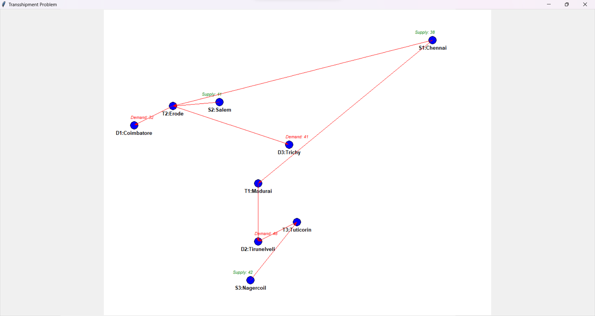

# Transshipment-Problem-Network_Flow

The Transshipment problem is an optimization issue in logistics
and supply chain management. It involves determining the most
cost-effective way to transport goods from supply nodes to
demand nodes, possibly through intermediate transshipment
nodes. The objective is to determine the optimal flow of goods
that minimizes transportation costs while satisfying supply and
demand constraints. 

## ABSTRACT:
The project aims to implement a Transshipment problem to
optimize the transportation of goods from supply cities to demand
cities through intermediate transshipment points within Tamil
Nadu. The solution involves linear programming techniques, using
the PuLP library, to minimize transportation costs while ensuring
that supply meets demand across the network. The network
consists of nine cities: three supply nodes (Chennai, Salem, Nagercoil), three demand nodes (Coimbatore, Tirunelveli, Trichy), and three transshipment nodes (Madurai, Erode, Tuticorin). Random values are generated for supply and demand, and these
values are balanced to ensure that total supply equals total
demand.The optimal flows between cities are then visualized
using a Tkinter-based graphical user interface (GUI). that shows
the movement of goods between cities based on the optimized
flow.This project not only finds the optimal solution for the
transshipment problem but also provides an interactive and
visual representation of the logistics network, that helps to
understand better and analyse the optimal transportation strategy.

## License
This project is licensed under the MIT License. See the LICENSE file for details.

## Author
Jagdeesh P
